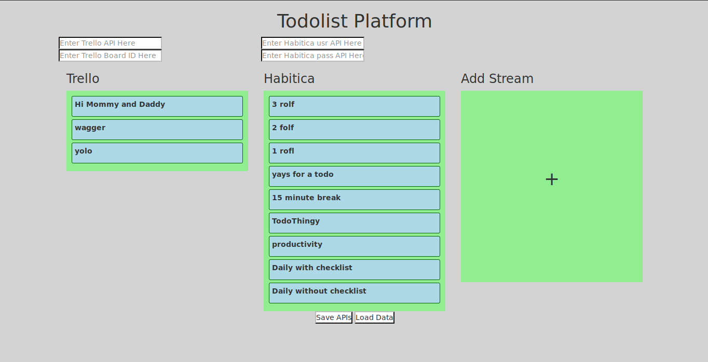

# todolist-platform [Abandoned]
Combines many progress apps into one easy viewing. Done at BridgeHacs. First time using MEAN stack. (AngularJS)

## Supported Todo's

 - Trello
 - Habitica

## Technologies Used

MEAN stack without MongoDB, so EAN stack.
To run, type in:

    node server

## Future Plans

Potentially have the todolists interact with each other, etc (requres MongoDB).

The end goal is to show overall combined progress over several todo applications.

### Why Temporarily Abandoned?
I've been moving around and using different todolist applications recently, and am still trying to find a reliable system.

Right now I'm using a combination of NirvanaHQ, Wunderlist, and Trello. NirvanaHQ currently doesn't have an API, so it would be pointless to continue this project for me until then. I also want to later include email in this list.

Yoke also achieves something similar. I'm focusing on a WunCur now: https://github.com/binamkayastha/WunCur

Update: No longer focusing on WunCur, now I am trying to create my own, called ETodo. In the future this may just be a plugin to that application. Until then, I have no idea.

